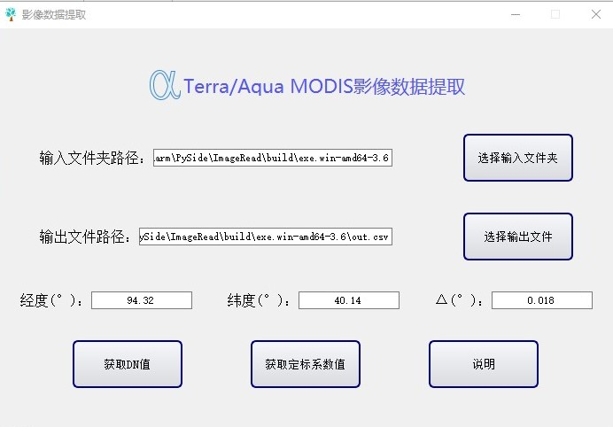
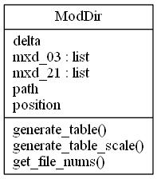
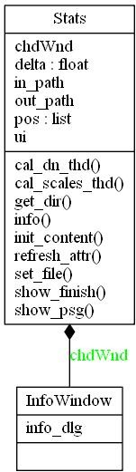
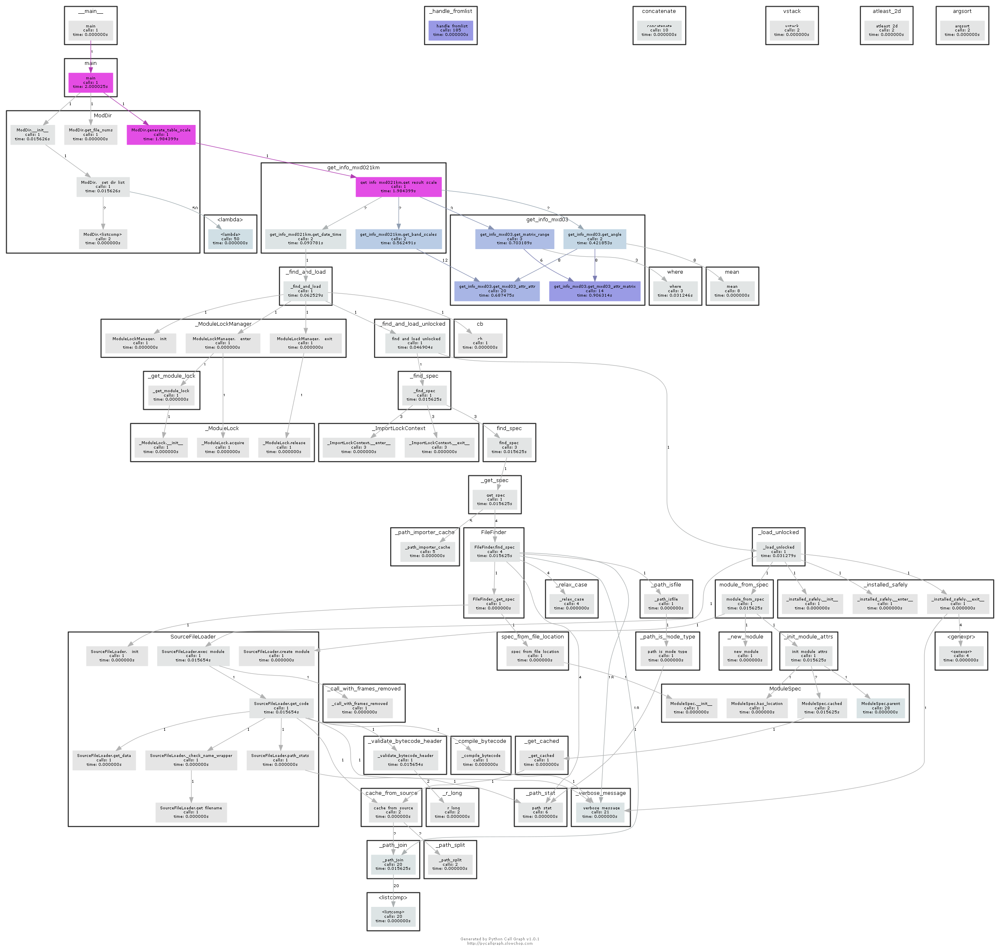

# proMDS 工具
 

`proMDS`是一个用来批量提取文件夹里面`MODIS`影像太阳光波段的平均`DN`值、定标系数的工具

## 用法

#### 输入

- 待提取的文件夹路径，文件夹应该包括一一对应的`mxd02`和`mxd03`的文件序列，数目应该相同
- 待输出的文件路径，`.csv`格式
- 提取位置的经纬度和小正方形的1/2边长(Δ)

#### 输出

- 输出为提取的文件数据

#### 运行界面

## 实现逻辑

#### 类

主要的计算类为`ModDir`，`UML`图如下

界面类为`Stats`，`UML`图如下

#### 调用关系

## API文档

运行代码文件有3个：`get_info_modis.py`、`get_info_mxd03.py`、`get_info_mxd021km.py`

界面代码文件有1个：`main.py`

ui文件有两个：`main.ui`、`info.ui`位于`.ui`文件夹内

### get_info_modis

#### NAME

​    get_info_modis

#### CLASSES

​    builtins.object
​        ModDir 

    class ModDir(builtins.object)
     |  Methods defined here:
     |  
     |  __init__(self, path, position, delta)
     |      初始化ModDir
     |      :param path:影像文件路径
     |      :param position:经纬度【经度，纬度】°
     |      :param delta:±经纬度偏移量
     |  
     |  generate_table(self, out_path)
     |      输出DN文件到指定路径（out_path）
     |      :param out_path:输出路径
     |      :return:None
     |  
     |  generate_table_scale(self, out_path)
     |      输出定标系数到指定路径（out_path）
     |      :param out_path:输出路径
     |      :return:None
     |  
     |  get_file_nums(self)
     |      命令行输出文件数目（mxd21km）
     |      :return:None
     |  
     |  ----------------------------------------------------------------------
     |  Data descriptors defined here:
     |  
     |  __dict__
     |      dictionary for instance variables (if defined)
     |  
     |  __weakref__
     |      list of weak references to the object (if defined)

### Main

#### NAME

​    main

#### CLASSES

​    builtins.object
​        InfoWindow
​        Stats
​    

    class InfoWindow(builtins.object)
     |  Methods defined here:
     |  
     |  __init__(self, parent)
     |      :param parent: 父窗口对象
     |  
     |  ----------------------------------------------------------------------
     |  Data descriptors defined here:
     |  
     |  __dict__
     |      dictionary for instance variables (if defined)
     |  
     |  __weakref__
     |      list of weak references to the object (if defined)
    
    class Stats(builtins.object)
     |  Methods defined here:
     |  
     |  __init__(self)
     |      Initialize self.  See help(type(self)) for accurate signature.
     |  
     |  cal_dn_thd(self, progress)
     |      调用ModDir.generate_table函数，得到DN值平均
     |      :param progress:线程对象
     |      :return:None
     |  
     |  cal_scales_thd(self, progress)
     |      调用ModDir.generate_table_scales函数，得到定标系数
     |      :param progress:线程对象
     |      :return:None
     |  
     |  get_dir(self)
     |      输入文件夹路径获取按钮槽函数
     |      :return:None
     |  
     |  info(self)
     |      产生说明窗口
     |      :return:None
     |  
     |  init_content(self)
     |      初始化函数
     |      :return:None
     |  
     |  refresh_attr(self)
     |      更新获取信息（主要更新路径信息）
     |      :return:None
     |  
     |  set_file(self)
     |      输出文件路径设置槽函数
     |      :return:None
     |  
     |  show_finish(self)
     |      完成显示信息窗口
     |      :return:None
     |  
     |  show_psg(self, target)
     |      显示进度条窗口
     |      :param target:线程处理函数
     |      :return:None
     |  
     |  ----------------------------------------------------------------------
     |  Data descriptors defined here:
     |  
     |  __dict__
     |      dictionary for instance variables (if defined)
     |  
     |  __weakref__
     |      list of weak references to the object (if defined)

### get_info_mxd021km

#### NAME

​    get_info_mxd021km

#### FUNCTIONS

​    get_band_dn(path_mxd021km, index)
​        :param path_mxd021km: 1km分辨率影像文件路径（mxd02km）
​        :param index: 索引点
​        :return: 太阳波段dn值平均
​    

    get_band_names(path_mxd021km)
        :param path_mxd021km: mxd02单个文件路径
        :return: list 太阳波段名称
    
    get_band_scales(path_mxd021km)
        :param path_mxd021km:mxd02单个文件路径
        :return:定标系数
    
    get_date_time(path_mxd021km)
        :param path_mxd021km:mxd02单个文件路径
        :return:时间数据
    
    get_result(path_mxd03_list, path_mxd02_list, position, delta)
        :param path_mxd03_list:mxd03文件所在路径
        :param path_mxd02_list:mxd02文件所在路径
        :param position:经纬度
        :param delta:经纬度偏移量
        :return:DataFrame格式的数据，影像中获取的DN值
    
    get_result_scale(path_mxd03_list, path_mxd02_list, position, delta)
        :param path_mxd03_list:mxd03文件所在路径
        :param path_mxd02_list:mxd02文件所在路径
        :param position:经纬度
        :param delta:经纬度偏移量
        :return:DataFrame格式的数据，影像中获取的定标系数
    
    main()

### get_info_mxd03:

#### NAME

​    get_info_mxd03

#### FUNCTIONS

​    get_angle(path_mxd03, index)
​        :param path_mxd03:str 文件位置
​        :param index:ndarray 位置索引
​        :return:list 太阳天顶角、太阳方位角、观测天顶角、观测方位角
​    

    get_matrix_range(path_mxd03, position, delta)
        :param path_mxd03: str mxd03文件所在位置
        :param position: tuple 地理坐标，经度和纬度
        :param delta: double 取坐标的范围
        :return: tuple 返回数值矩阵所在的索引，左下、左上、右下、右上
    
    get_mxd03_attr_attr(path_mxd03, attr1, attr2)
        :param path_mxd03:mxd03文件所在位置
        :param attr1:mxd03影像的数据集名称
        :param attr2:mxd03影像的数据集属性
        :return:属性值
    
    get_mxd03_attr_matrix(path_mxd03, attr)
        :param path_mxd03: mxd03文件所在位置
        :param attr: mxd03影像的属性
        :return: mxd影像属性对应的数据集
    
    get_mxd_attr(path_mxd, attr)
        :param path_mxd:mxd单个文件所在位置
        :param attr:mxd03影像的数据集名称
        :return:数据集的DN值
    
    main()

